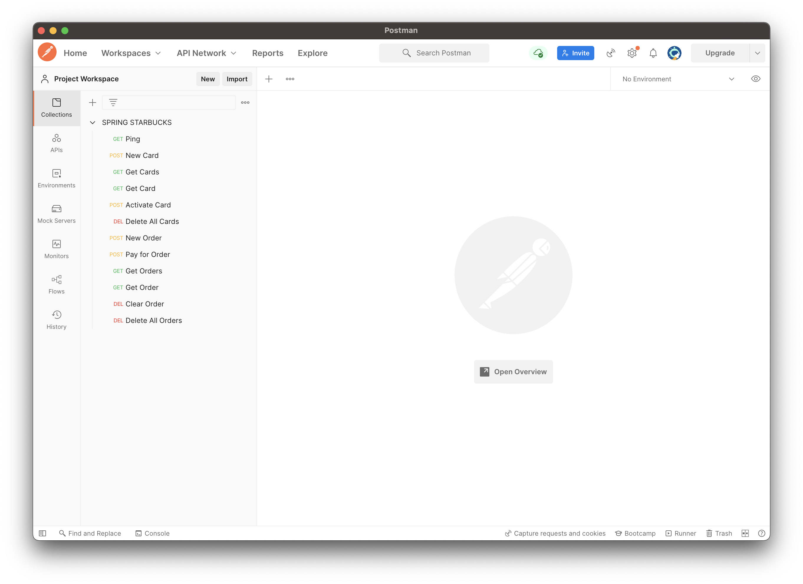
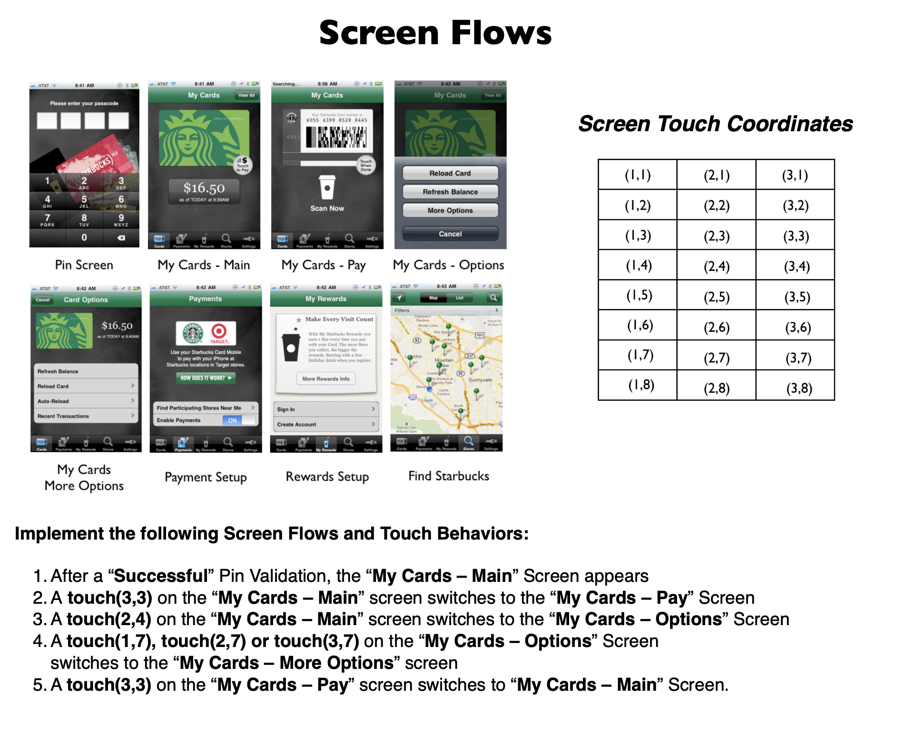
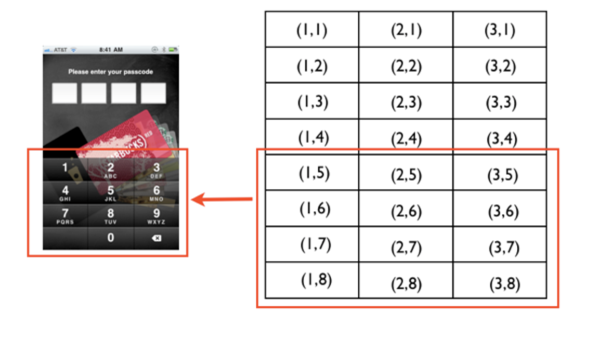
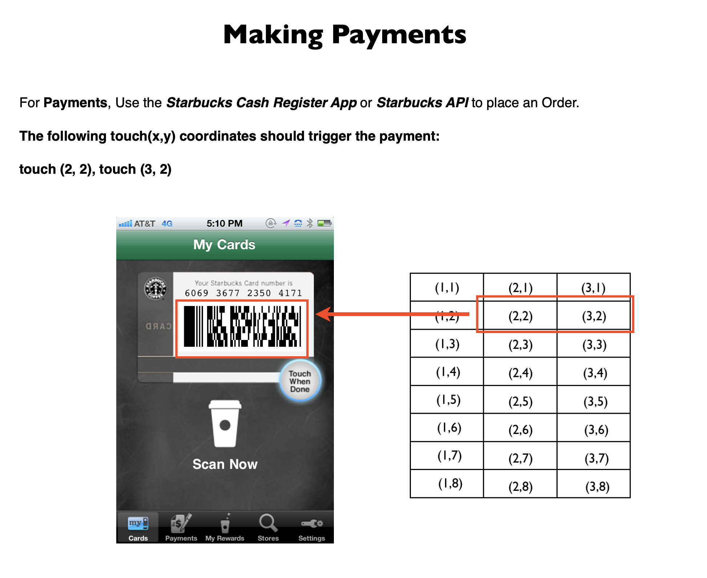
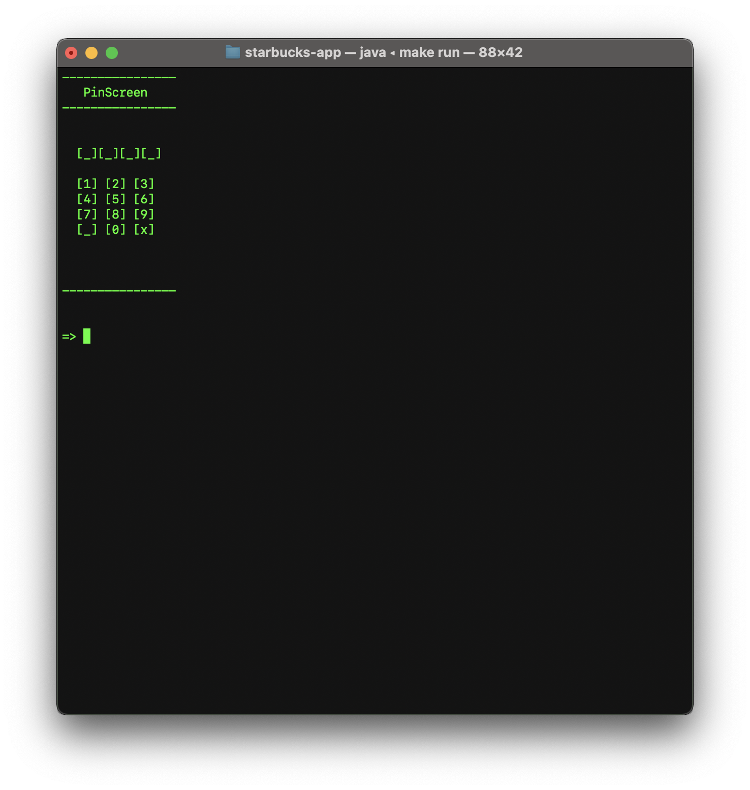

# Starbucks End-to-End Example


## REST API 

Run the provided Starbucks API.  See Demo in class on how to setup, build and run Starbucks API.  Then test using the provided Postman Project.




The Starbucks API Specification is as follows:

```
Ping Health Check.

GET 	/ping
		

		{
		    "test": "Starbucks API version 3.1 alive!"
		}		


Get a list of Starbucks Cards (along with balances).

GET 	/cards 

		[
		    {
		        "cardNumber": "344329363",
		        "cardCode": "257",
		        "balance": 20.0,
		        "activated": false,
		        "status": "New Card"
		    },
		    {
		        "cardNumber": "323586828",
		        "cardCode": "607",
		        "balance": 20.0,
		        "activated": false,
		        "status": "New Card"
		    }
		]		


Create a new Starbucks Card.

POST 	/cards

		{
		    "cardNumber": "299255600",
		    "cardCode": "903",
		    "balance": 20.0,
		    "activated": false,
		    "status": "New Card"
		}


Get the details of a specific Starbucks Card.

GET 	/cards/{num}

		

		{
		    "cardNumber": "299255600",
		    "cardCode": "903",
		    "balance": 20.0,
		    "activated": false,
		    "status": "New Card"
		}


Activate Card 

POST 	/card/activate/{num}/{code}

		{
		  "CardNumber": "627131848",
		  "CardCode": "547",
		  "Balance": 20,
		  "Activated": true,
		  "Status": ""
		}


Create a new order. Set order as "active" for register.

POST    /order/register/{regid}
        
        Request:

	{
	    "drink": "Caffe Latte",
	    "milk":  "Whole",
	    "size":  "Grande"
	}           

	Response:

	{
	    "drink": "Caffe Latte",
	    "milk": "Whole",
	    "size": "Grande",
	    "total": 3.91,
	    "status": "Ready for Payment.",
	    "register": "5012349"
	}	    


Request the current state of the "active" Order.

GET     /order/register/{regid}
        
	{
	    "drink": "Caffe Latte",
	    "milk": "Whole",
	    "size": "Grande",
	    "total": 3.91,
	    "status": "Ready for Payment.",
	    "register": "5012349"
	}


Clear the "active" Order.

DELETE  /order/register/{regid}
       
	{
	    "Status": "Active Order Cleared!"
	}


Process payment for the "active" Order. 

POST    /order/register/{regid}/pay/{cardnum}
        
        Response: (with updated card balance)

	{
	    "cardNumber": "299255600",
	    "cardCode": "903",
	    "balance": 16.09,
	    "activated": true,
	    "status": "New Card"
	}


Get a list of all active orders (for all registers)

GET     /orders
        
	[
	    {
	        "drink": "Caffe Latte",
	        "milk": "Whole",
	        "size": "Grande",
	        "total": 3.91,
	        "status": "Ready for Payment.",
	        "register": "5012349"
	    },
	    {
	        "drink": "Caffe Latte",
	        "milk": "Whole",
	        "size": "Grande",
	        "total": 3.91,
	        "status": "Paid with Card: 299255600 Balance: $16.09.",
	        "register": "5012349"
	    }
	]


Delete all Cards (Use for Unit Testing Teardown)

DELETE 	/cards

	{
	  "Status": "All Cards Cleared!"
	}


Delete all Orders (Use for Unit Testing Teardown)

DELETE 	/orders	

	{
	  "Status": "All Orders Cleared!"
	}

```


## Example Usage for Starbucks Mobile App Simulator

* Screen Flows



* Starbucks PIN Screen



* Making Payments




## Explore the Sample Node.js and Java Mobile App Simulator

Run these Apps against the Starbucks API and explore how they work.

### Example Workflow

1. Run Starbucks API 

* Launch via Docker Image:  paulnguyen/spring-starbucks-api

```
	docker network create --driver bridge starbucks

	docker run --network starbucks --name spring-starbucks-api -td -p 8080:8080 \
	--platform=linux/amd64 paulnguyen/spring-starbucks-api	

```

2. Starbucks App (Mobile App Simulator)

* Requires Gradle 4.9 and Java JDK 8
* Launch and Login with PIN: 1234 



3. Placing an Order on the Starbucks Cash Register (Node.js App)

* Run via Docker Image: paulnguyen/starbucks-nodejs

```
	docker run --network starbucks --name starbucks-nodejs -td -p 90:9090  \
	-e "api_endpoint=http://spring-starbucks-api:8080" \
	--platform=linux/amd64 paulnguyen/starbucks-nodejs
```

4. Paying on the Starbucks App


5. See Balance on Starbucks Card after Payment


6. Check Starbucks Cash Register for Successful Payment (Node.js App)


7. Sample REST API Calls from Insomnia (List Cards)


8. Sample REST API Calls from Insomnia (List Orders)


# Reference

* http://kong.github.io/unirest-java
* https://www.baeldung.com/unirest
* http://stleary.github.io/JSON-java/index.html
* https://www.programcreek.com/java-api-examples/?api=com.mashape.unirest.http.Unirest


